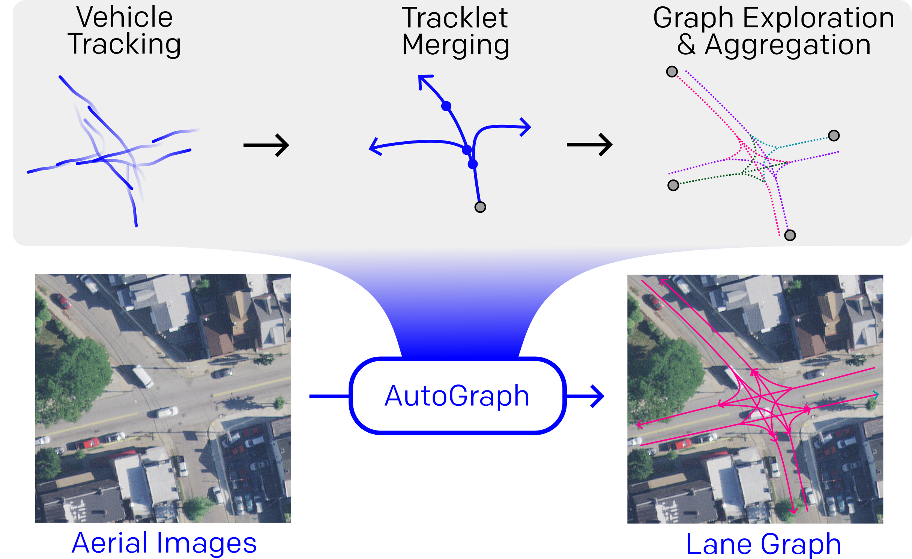

# AutoGraph: Predicting Lane Graphs from Traffic Observations

This repository contains the code for the paper "AutoGraph: Predicting Lane Graphs from Traffic Observations" by Jannik Zürn, Ingmar Posner, and Wolfram Burgard.





## 1: Installation

Create a conda environment created from the `environment.yml` file. It contains all the dependencies needed to 
run the models.


```bash
conda env create -f environment.yml
conda activate urbanlanegraph
```


## 2: Dataset Download

### Tracklets

Please download the parsed tracklets from the [AutoGraph website](http://autograph.cs.uni-freiburg.de/).

After unzipping, the dataset contains a `.npy` file for each city in the UrbanLaneGraph dataset. Each `.npy` file contains a list of tracklets for the respective city. The respective aerial images and human-annotated lane graphs may be found in the UrbanLaneGraph dataset.


### Aerial Images and Lane Graphs for Evaluation


To download the aerial images and lane graphs from the UrbanLaneGraph Dataset, please follow the instructions on the [website](http://urbanlanegraph.cs.uni-freiburg.de/).


## 2: Alternative: Parse Tracklets from Scratch from Argoverse2 Dataset

Alternatively, you can parse the tracklets from the Argoverse2 dataset yourself. To do so, please first download the Argoverse2 dataset.

This feature is currently under development. Please refer to the source files in `aggregation/` for more information.


## 3: Model Training

The models defined in `regressors/` can be trained using the traing script `train_centerline_regression.py` 

Please adjust the parameters in the config file `cfg.yaml` to your needs.


### 3.1 train full regressor
`python train_regression_pos_query.py --config cfg.yaml --visualize --target full --dataset_name /path/to/dataset/tracklets_joint --visualize`

### 3.2 train successor regressor
`python train_regression_pos_query.py --config cfg.yaml --target successor --dataset_name /path/to/dataset/tracklets_joint --input_layers rgb --visualize`


Please refer to the run flags in the training script for more information.

```python
    parser.add_argument('--config', type=str, help='Provide a config YAML!', required=True)
    parser.add_argument('--dataset', type=str, help="dataset path")
    parser.add_argument('--version', type=str, help="define the dataset version that is used")
    parser.add_argument('--stego', action="store_true", default=False, help="If True, applies stego loss")
    parser.add_argument('--visualize', action='store_true', help="visualize the dataset")
    parser.add_argument('--disable_wandb', '-d', action='store_true', help="disable wandb")
    parser.add_argument('--dataset_name', type=str, help="which dataset to use for training")
    parser.add_argument('--target', type=str, help="which target to use for training", choices=["full", "successor"])
    parser.add_argument('--input_layers', type=str, help="which input layers to use for training", choices=["rgb", "rgb+drivable", "rgb+drivable+angles"])
    parser.add_argument('--inference', action='store_true', help="perform inference instead of training")
    parser.add_argument('--full-checkpoint', type=str, default=None, help="path to full checkpoint for inference")
    parser.add_argument('--city', type=str, default="all", help="city to use for training")
```


## 3: Model Inference


### 3.1 Inference on single images

To run the model inference script, please run
`python inference_regressor.py`

Adjust your system paths accordingly in the source file.


### 3.2 Drive on a map


We can also specify a tile on which to drive along our own predicitions. To do so, please run
`python driver.py <tile_id> <data_source>`

where `<tile_id>` is the tile id of the tile you want to drive on, and `<data_source>` is the path to the dataset.

